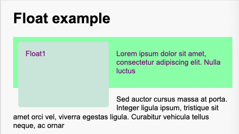
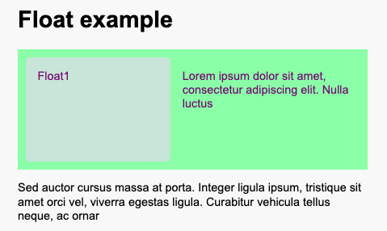
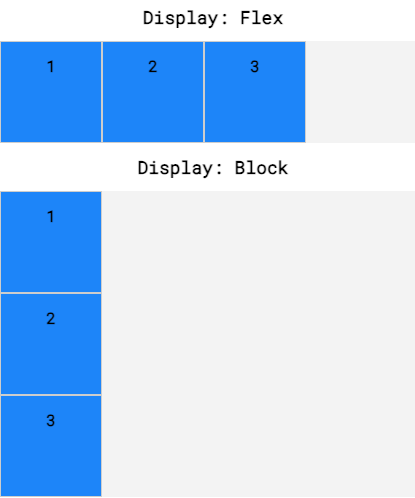

# Layout

Everything in CSS has a box around it.

Depending on how the box behaves in terms of _page flow and in relation to other boxes on the page_.

Boxes have:

- an **inner display type**: how elements inside the box are laid out
- an **outer display type**: how the box is laid out in relation to other boxes around it
  - `block` v. `inline`

<!-- TODO: make a table for the outer type comparison -->

## Block boxes

- The box will break onto a new line
- The `width` and `height` properties are respected
- Padding, margin and border will cause other elements to be pushed away from the box
- If `width` is not specified, the box will extend in the inline direction to fill the space available in its container
- In most cases, the box will become as wide as its container, filling up 100% of the space available

Some elements, such as `<h1>` and `<p>`, use `block` as their outer display type by default.

## Inline boxes

- The box will not break onto a new line
- The `width` and `height` properties will not apply
- Top and bottom padding, margins, and borders will apply but will not cause other inline boxes to move away from the box
- Left and right padding, margins, and borders will apply and will cause other inline boxes to move away from the box

Elements such as `<a>`, `<span>`, `<em>` and `<strong>` use `inline` as their outer display type by default.

## Setting the type

`display` sets both outer and inner at once.

```css
display: block; /* block outer, normal inner (flow) */
display: flex; /* block outer, flex inner */
display: inline-flex; /* inliner outer, flex inner */
display: grid; /* block outer, grid inner */
display: inline-grid; /* inline outer, grid inner */
```

<!-- FIXME: what's the rule? -->

It seems that unless `<>-<>` format is used, the `display` value is for the outer display.

## Standard Box Model


What is the actual dimension of `box`?

```css
.box {
  width: 350px;
  height: 150px;
  margin: 10px;
  padding: 25px;
  border: 5px solid black;
}
```

- `width` and `height ` define the dimension of the **content box**.
- The margin is not counted towards the actual size of the box - it only affects the space outside the box.
- Actual width: `350  + 25*2 + 5*2 =  410`
- Actual height: `150 + 25*2 + 5*2 = 210`
- **Summary**: `content_dimension + padding * 2 + border * 2`

## Alternative Box Model

To turn it on, set `box-sizing: border-box`.

Any width is the width of the visible box on the page. The content area width is `width - padding - border`.

## Margin

Margins can be positive or negative; setting a negative value can cause it to overlap other things.

### Margin collapsing

It happens when you're creating space with margins and don't get the space you expect.

- Two positive margins will combine to become one. Its size will be equal to the largest individual margin.
- Two negative margins will collapse and the smallest (furthest from zero) value will be used.
- If one margin is negative, its value will be subtracted from the total.

## Padding

It sits between the border and the content area and is used to push the content away from the border. It cannot be negative.

## `inline-block`

`display: inline-block` is a special value of `display`, which provides a middle ground between `inline` and `block`.

Use it if you don't want an item to break onto a new line, but to respect `width` and `height` and avoid overlapping.

- `width` and `height` are respected
- `padding`, `margin`, and `border` will cause other elements to be pushed away from the box.

## Float

A float is removed from normal flow and other elements will display beside it.

It can be cleared with `clear: left/right/both`.

### `display: flow-root`

It makes the element behave like a `block` and contain its floating children properly.

#### Before



```html title="index.html"
<h1>Float example</h1>
<div class="wrapper">
  <div class="box">Float1</div>

  <p>Lorem ipsum dolor sit amet, consectetur adipiscing elit. Nulla luctus</p>
</div>

<p>
  Sed auctor cursus massa at porta. Integer ligula ipsum, tristique sit amet
  orci vel, viverra egestas ligula. Curabitur vehicula tellus neque, ac ornar
</p>
```

```css title="style.css"
body {
  width: 90%;
  max-width: 900px;
  margin: 0 auto;
  font: 0.9em/1.2 Arial, Helvetica, sans-serif;
}

.box {
  float: left;
  margin-right: 15px;
  width: 150px;
  height: 100px;
  border-radius: 5px;
  background-color: rgb(207 232 220);
  padding: 1em;
}

.wrapper {
  background-color: rgb(148 255 172);
  padding: 10px;
  color: purple;
}
```

#### After



```css title="style.css"
.wrapper {
  background-color: rgb(148 255 172);
  padding: 10px;
  color: purple;
  display: flow-root;
}
```

## Positioning

### Relative positioning

### Absolute positioning

It removes the element from the normal flow and create a layer for itself. Very useful for implementing UI elements separated from the rest of the page, dnd etc.

### Introducing z-index

### Fixed positioning

For creating UI fixed in place no matter the size of the viewport. It's in relation to the VP.

### Sticky positioning

## Flex

```css
body {
  display: flex;
}
```

- Flexbox is very common among CSS styling
- If they have children, the children are flex items
  - Child elements will NOT begin on new lines
- A dic with the declaration `display: flex;` will remain block-level - it occupies its own line.



### Main Axis (horizontal)

- `justify-content`: how items are positioned from left to right.
- `flex-wrap`
- `flex-grow`
- `flex-shrink`

### Cross Axis (vertical)

- `align-items`:
- `align-content` spaces rows from top to bottom if there are multiple rows.

### `z-axis` (depth)

## Grid

Whereas Flexbox is mostly useful for positioning items in a one-dimensional layout, CSS grid is most useful for **two-dimensional** layouts, providing many tools for aligning and moving elements across both rows and columns.

### `grid-template`

This is to be used on the _grid container_.

- `grid-template-rows`
- `grid-template-columns`
- `grid-template-areas`

#### `fr` (fraction)

`1fr` means 1 fraction of the **available/remaining space**, which is the space to fill minus the base sizes of the non-flexible grid tracks. Such as -

- paddings
- borders
- gaps between grid items
- columns/rows with fixed sizes (e.g. 100px, 25%)

```cs
.container {
  display: grid;
  grid-template-rows: 3fr 4fr 1fr;
  grid-template-columns: 1fr 1fr 1fr;
}
```

It can be used with `repeat()`.

```css
grid-template-rows: repeat(2, 20px 50px)
grid-template-columns: repeat(3, 1fr);
```

### `grid-area`

This is to be used on the _grid content_.

`grid-area` is a combination attribute:

1. grid-row-start
2. grid-column-start
3. grid-row-end
4. grid-column-end

```css
.item {
  /* row2-4, col3-8 */
  grid-area: 2 / 3 / 4 / span 5;
}
```
