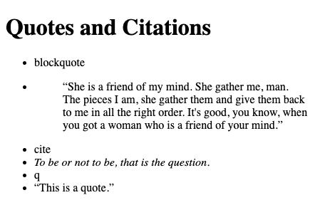

# HTML Text Basics

## Headings

By default, browsers style `<h1>` the largest, `<h2>` slightly smaller, with each subsequent heading level being smaller by default.

Browsers by default also decrement the `<h1>` font size based on how many `<article>`, `<aside>`, `<nav>`, or `<section>` elements it is nested in.


To style nested `<h1>` elements:

```css
/* 
- Any <h2> elements
- Any <h1> elements that are inside any <article>, <aside>, <nav>, or <section> */
h2,
:is(article, aside, nav, section) h1 {
}

/* 
- Any h3 element
- Any h1 that is inside a (article, aside, nav, section), which is itself inside a (article, aside, nav, section) */
h3,
:is(article, aside, nav, section) :is(article, aside, nav, section) h1 {
}
```

`:is()` is a CSS pseudo-class for grouping selectors, making them easier to write and more efficient.

`:is(a, b, c)` matches any element that matches selector a, b, or c.

## Quotes and citations

1. `<blockquote>`
2. `<q>`
3. `<cite>`



```html
<h1>Quotes and Citations</h1>
<ul>
  <li>blockquote</li>
  <li>
    <blockquote>
      “She is a friend of my mind. She gather me, man. The pieces I am, she
      gather them and give them back to me in all the right order. It's good,
      you know, when you got a woman who is a friend of your mind.”
    </blockquote>
  </li>
  <li>cite</li>
  <li><cite>To be or not to be, that is the question.</cite></li>
  <li>q</li>
  <li><q>This is a quote.</q></li>
</ul>
```
